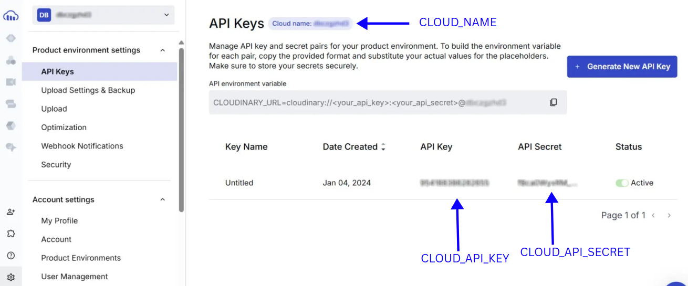

  

------------

    
  Made by Nothing Apps

## Setting Up the Environment Variables

To ensure your application runs smoothly, set the following environment variables in your `.env` file or environment configuration. Below is a detailed list:

1. **PORT**  
   The port number where your application will run. Default: `3000`.

2. **MONGO_CONNECTION_STRING**  
   The connection string for your MongoDB database. Example: `mongodb+srv://<username>:<password>@cluster.mongodb.net/<dbname>?retryWrites=true&w=majority`.

3. **FRONTEND_URL**  
   The base URL for the frontend application. Example: `https://example.com`.

4. **AUTH_SECRET**  
   A secret key used for authentication and JWT token encryption.

5. **SYSTEM_ACCESS_TOKEN**  
   Here we are using this for debugging access token we get from those who signed up using embedded sign up

6. **VERIFY_TOKEN**  
   A token used to validate webhook requests from meta we configured

7. **VERSION**  
   The current version of Whatsapp cloud api

8. **STRIPE_END_POINT_SECRET**  
   The endpoint secret used to verify incoming Stripe webhook events.

9. **STRIPE_SECRET_KEY**  
   Your Stripe secret API key for processing payments.

   

    
  In cloudinary dashboard you can click "Go to API Keys" and get above credentials 
  

10. **CLOUD_NAME**  
    The Cloudinary cloud name from cloudinary dashboard.

11. **CLOUD_API_KEY**  
    The API key for accessing your Cloudinary account.

12. **CLOUD_API_SECRET**  
    The secret API key for your Cloudinary account.
